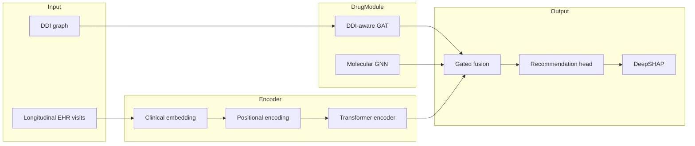

# Transformer-GAT Medication Recommendation

A research implementation of a **Transformer- and graph-based framework** for safe, explainable medication recommendation from longitudinal electronic health records (EHRs). The system combines temporal self-attention, DDI-aware graph learning, molecular drug representations, and DeepSHAP-based explainability within a unified clinical decision support pipeline.

> **Clinical decision support only.** This software does not prescribe autonomously. All recommendations require qualified physician review before any clinical use.

---

## Overview

Polypharmacy in multimorbidity patients creates substantial risk from drug–drug interactions (DDIs) and complex longitudinal disease trajectories. This repository implements a seven-module architecture that jointly models patient visit sequences, pharmacological safety constraints, and per-patient explanation — designed for reproducible experimentation on MIMIC-III-style data.

**Core capabilities**

- Longitudinal EHR encoding with a 4-layer Transformer (8 heads, `d_model=256`)
- Dual-graph drug module: DDI-aware Graph Attention Network + molecular substructure GNN
- Learnable gated fusion for adaptive patient–drug representation weighting
- Multi-objective training with severity-weighted DDI penalty
- DeepSHAP feature attribution for patient-specific explanations
- Interactive web dashboard for exploration and evaluation
- Ablation, multi-seed validation, and λ\_DDI Pareto analysis scripts

---

## Architecture



| Module | Description | Status |
|--------|-------------|--------|
| 1 | Clinical embedding + sinusoidal positional encoding | ✅ Implemented |
| 2 | Transformer temporal encoder (L=4, h=8) | ✅ Implemented |
| 3 | Learnable gated fusion | ✅ Implemented |
| 4 | Dual-graph drug module (DDI-GAT + molecular GNN) | ✅ Implemented |
| 5 | Multi-objective loss | ✅ `L_rec` + `L_DDI` active; `L_outcome` / `L_xai` stubbed |
| 6 | Layered explainability (7 methods specified) | ✅ DeepSHAP only |
| 7 | TCN outcome monitoring | 📋 Spec only (`src/models/outcome_tcn.py`) |

**Loss function**

```
L_total = λ₁·L_rec + λ₂·L_DDI + λ₃·L_outcome + λ₄·L_xai
```

| Weight | Default | Role |
|--------|---------|------|
| λ₁ | 1.0 | Multi-label recommendation accuracy (BCE) |
| λ₂ | 0.5 | Severity-weighted DDI co-prescription penalty |
| λ₃ | 0.3 | Outcome prediction (inactive until Module 7 is wired) |
| λ₄ | 0.1 | Explanation fidelity (inactive until IG is implemented) |

---

## Requirements

- Python 3.10+
- PyTorch 2.0+
- PyTorch Geometric 2.4+
- 8 GB RAM minimum (CPU training); GPU recommended for full runs

See [`requirements.txt`](requirements.txt) for the complete dependency list.

---

## Installation

```bash
git clone https://github.com/mehra-es/transformer_gat_medrec.git
cd transformer_gat_medrec

python3 -m venv .venv
source .venv/bin/activate        # Windows: .\.venv\Scripts\Activate.ps1
pip install -r requirements.txt
```

**One-command setup** (Linux / macOS):

```bash
./run.sh setup
```

---

## Quick start

Run the full pipeline — setup, training, evaluation, tests, and web dashboard:

```bash
./run.sh                  # Linux / macOS
.\run.ps1                 # Windows PowerShell
run.bat                   # Windows CMD
```

Dashboard: **http://127.0.0.1:8080**

| Command | Description |
|---------|-------------|
| `./run.sh train` | Train model (MIMIC-III demo by default) |
| `./run.sh eval` | Evaluate `checkpoints/best.pt` on test set |
| `./run.sh explain` | Run DeepSHAP for patient 0 |
| `./run.sh test` | Run unit tests |
| `./run.sh ui` | Launch dashboard only |
| `./run.sh all --skip-train` | Skip training if checkpoint exists |

---

## Usage

### Training

Default data source is the open [MIMIC-III Demo v1.4](https://physionet.org/content/mimiciii-demo/1.4/) subset (auto-downloaded on first run):

```bash
python src/main.py --config config.yaml --mode train
```

Synthetic data for fast local testing:

```bash
python src/main.py --config config.yaml --mode train --use_synthetic true
```

Checkpoints are saved to `checkpoints/best.pt` (early stopping on validation Jaccard).

### Evaluation

```bash
python src/evaluate.py --checkpoint checkpoints/best.pt
```

**Metrics reported:** Jaccard, F1-micro, F1-macro, PRAUC, DDI rate, and Safety-Adjusted Effectiveness (SAE = Jaccard × (1 − DDI rate)).

### Explainability

Patient-specific DeepSHAP attributions against each patient's top-predicted medications:

```bash
python src/explain.py --checkpoint checkpoints/best.pt --patient_idx 0
```

### Experimental scripts

```bash
# Four-seed statistical validation (seeds: 42, 1, 123, 2024)
python scripts/run_multi_seed.py --use_synthetic false

# Safety–accuracy Pareto sweep over λ_DDI
python scripts/pareto_sweep.py --use_synthetic false

# Ablation study (all variants)
python src/ablation/run_ablation.py --variant all --use_synthetic false
```

**Ablation variants:** `full`, `no_transformer`, `no_gat`, `no_molecular_gnn`, `no_gated_fusion`, `no_ddi_loss`

---

## Configuration

All hyperparameters are defined in [`config.yaml`](config.yaml):

| Parameter | Value |
|-----------|-------|
| Learning rate | 1×10⁻⁴ (AdamW, weight decay 1×10⁻²) |
| Batch size | 64 |
| `d_model` | 256 |
| Transformer layers / heads | 4 / 8 |
| GAT layers | 3 |
| Dropout | 0.30 |
| Max epochs | 50 (early stopping, patience 15) |
| Gradient clipping | 1.0 |
| Decision threshold | 0.5 |
| Train / val / test split | 70% / 15% / 15% (patient-level) |

---

## Project structure

```
transformer_gat_medrec/
├── config.yaml              # Hyperparameters and paths
├── run.sh / run.ps1         # Pipeline entry points
├── src/
│   ├── main.py              # CLI: train | eval | explain
│   ├── train.py             # Training loop
│   ├── evaluate.py          # Test-set evaluation
│   ├── explain.py           # DeepSHAP explanations
│   ├── models/              # Architecture modules
│   ├── losses/              # Multi-objective loss
│   ├── data/                # Loading, preprocessing, DDI graph
│   ├── metrics/             # Jaccard, F1, PRAUC, DDI, SAE
│   └── ablation/            # Ablation runner
├── scripts/
│   ├── run_multi_seed.py    # Multi-seed validation
│   └── pareto_sweep.py      # λ_DDI sweep
├── ui/                      # FastAPI dashboard
├── tests/                   # Unit tests
└── data/                    # Raw and processed datasets
```

---

## Data

| Mode | Command flag | Description |
|------|--------------|-------------|
| **MIMIC-III demo** (default) | `--use_synthetic false` | PhysioNet open-access demo; no credentials required |
| **Synthetic** | `--use_synthetic true` | In-memory generator for development and CI |

Patient-level splitting prevents visit-level data leakage. For the full MIMIC-III GAMENet cohort (5,430 patients, 153 medications), extend [`src/data/preprocessing.py`](src/data/preprocessing.py) with credentialed PhysioNet access. See [`data/README.md`](data/README.md).

---

## Web dashboard

The interactive dashboard provides:

| View | Content |
|------|---------|
| **Pipeline** | Run setup, train, eval, test, and SHAP with live logs |
| **Overview** | Architecture and data flow |
| **Patient timeline** | Per-visit diagnoses, medications, and labs |
| **Recommendations** | Top drug probabilities vs. ground truth |
| **Fusion & safety** | Gate balance and detected DDI pairs |
| **Explainability** | DeepSHAP feature attributions |
| **Evaluation** | Test-set metrics |

```bash
pip install fastapi uvicorn   # included in requirements.txt
python ui/server.py
```

---

## Testing

```bash
pytest tests/ -v
# or
./run.sh test
```

---

## Scope and limitations

This repository provides a **partial but experimentally validated** implementation of the full seven-module architecture:

- **Active:** Transformer encoder, dual-graph drug module, gated fusion, DDI-aware loss, DeepSHAP
- **Specified, not evaluated:** TCN outcome monitoring, Integrated Gradients, LRP, GNNExplainer, counterfactual generation
- **Dataset:** Default demo subset; full-scale MIMIC-III results require credentialed data and extended preprocessing

Intended for **research reproducibility and clinical decision support prototyping** — not for direct deployment without institutional validation, IRB approval, and clinical workflow integration.

---

## Disclaimer

This software is provided for research and educational purposes. It is not a medical device and has not been cleared or approved by any regulatory authority. Developers and contributors assume no liability for clinical decisions made using model outputs. Always consult qualified healthcare professionals before making treatment decisions.

---

## Authors

**Mehra Esfandiari**

For questions, issues, or collaboration inquiries, please open a [GitHub issue](https://github.com/mehra-es/transformer_gat_medrec/issues).
